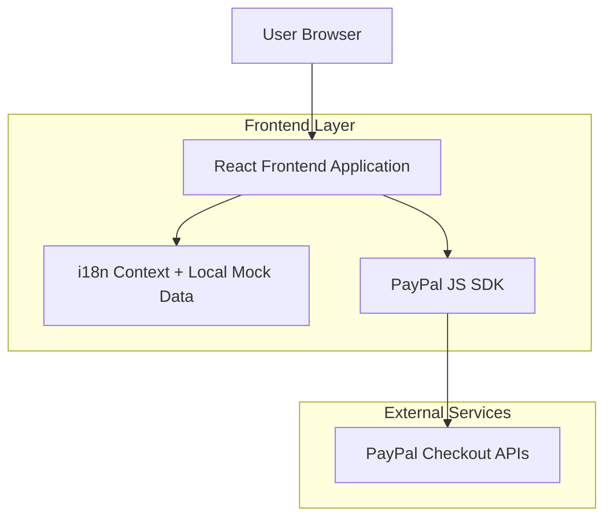

## 1.Architecture design

## 2.Technology Description
- Frontend: React@18 + TypeScript + vite
- UI/Styles: tailwindcss@3 (desktop-first, responsive)
- Routing: react-router-dom@6
- i18n: Context propio (LanguageProvider) + diccionarios JSON (ES/EN)
- PayPal: @paypal/react-paypal-js (Smart Payment Buttons)
- Data: mocks locales (TS/JSON) versionados en el repo
- Backend: None

## 3.Route definitions
| Route | Purpose |
|-------|---------|
| / | Landing premium con secciones, pricing y selector de idioma |
| /checkout | Checkout de PayPal por plan (lee `?plan=...`) |
| /payment-result | Resultado post-pago (lee `?status=success|cancel|error&plan=...`) |

## 4.API definitions (If it includes backend services)
No aplica (frontend-only). La integración con PayPal se hace desde el navegador mediante el SDK.

## 6.Data model(if applicable)
No hay base de datos. Los datos se modelan como tipos TypeScript:
- `Plan`: `{ id: string; nameKey: string; descriptionKey: string; price: number; currency: "EUR"|"USD"; bulletsKeys: string[]; paypalAmount: string }`
- `ServiceItem`: `{ id: string; titleKey: string; descriptionKey: string; icon: string }`
- `Testimonial`: `{ id: string; quoteKey: string; author: string; roleKey: string }`
- `FaqItem`: `{ id: string; qKey: string; aKey: string }`

Notas de seguridad/operación:
- El `PayPal Client ID` se configura por variable de entorno (ej. `VITE_PAYPAL_CLIENT_ID`).
- Este sitio no protege recursos ni gestiona cuentas; solo vende planes y muestra confirmación al usuario.
