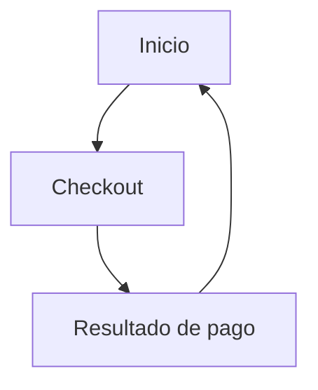

## 1. Product Overview
Sitio web premium de Feng Digital Services para presentar servicios y convertir visitas en compras de planes mediante checkout PayPal.
Incluye i18n ES/EN basado en contexto, contenido/secciones configurables y datos mock locales (sin backend).

## 2. Core Features

### 2.1 User Roles
No se requieren roles ni registro (sitio público con compra de planes).

### 2.2 Feature Module
El producto se compone de las siguientes páginas principales:
1. **Inicio**: propuesta de valor, servicios, casos/beneficios, precios (planes), FAQ, CTA, selector de idioma, enlaces legales.
2. **Checkout**: resumen del plan, datos del comprador (solo visual/validación local), PayPal Smart Buttons, manejo de estados.
3. **Resultado de pago**: confirmación de éxito o cancelación/error, siguientes pasos y CTA de contacto.

### 2.3 Page Details
| Page Name | Module Name | Feature description |
|-----------|-------------|------------------|
| Inicio | Selector de idioma | Cambiar ES/EN y persistir preferencia (localStorage) aplicando textos desde diccionarios. |
| Inicio | Navegación + anclas | Navegar por secciones (Servicios, Planes, FAQ, Contacto) con scroll suave. |
| Inicio | Sección Hero | Mostrar titular, subtítulo, CTA principal (“Ver planes”) y CTA secundario (“Contactar”). |
| Inicio | Servicios | Listar servicios premium (tarjetas) con icono, descripción corta y beneficios clave. |
| Inicio | Prueba social | Mostrar testimonios/mini-casos (mock) con resultados y breve contexto. |
| Inicio | Planes y precios | Renderizar planes desde mock local (mensual/anual si aplica), incluir comparativa simple y botón “Contratar” que abre /checkout?plan=ID. |
| Inicio | FAQ | Resolver objeciones comunes (mock local), acordeón accesible. |
| Inicio | Contacto (CTA) | Mostrar email/WhatsApp/enlace y un formulario simple sin envío (solo UI) o mailto con asunto prellenado. |
| Inicio | Footer + legales | Mostrar enlaces a Términos, Privacidad (como secciones o modales estáticos) y redes. |
| Checkout | Carga de plan | Leer planId desde querystring, cargar detalle desde mock local y validar existencia. |
| Checkout | Resumen + totales | Mostrar nombre del plan, precio, entregables incluidos y total (sin impuestos dinámicos). |
| Checkout | PayPal Checkout | Iniciar pago con PayPal (Client ID por env), crear orden por importe del plan y capturar pago. |
| Checkout | Estados y errores | Mostrar estados: cargando, listo, pagado, cancelado, error; permitir reintento. |
| Resultado de pago | Confirmación | Mostrar mensaje según status (success/cancel/error) y detalles mínimos (plan, fecha, referencia si se dispone). |
| Resultado de pago | Siguientes pasos | Indicar cómo se contactará FDS / qué debe hacer el cliente y CTA a volver a Inicio o reintentar. |

## 3. Core Process
**Flujo visitante (ES/EN):**
1) Entras a Inicio, cambias idioma si lo deseas. 2) Revisas servicios, testimonios y comparas planes. 3) Pulsas “Contratar” en un plan. 4) En Checkout confirmas el resumen y pagas con PayPal. 5) Ves Resultado (éxito/cancelación/error) y sigues el CTA correspondiente.

### Datos mock locales (fuente de verdad en frontend)
- `mock/plans.ts`: `{ id, nameKey, descriptionKey, price, currency, bulletsKeys[], paypalAmount }`
- `mock/content.ts`: secciones (hero, servicios, testimonios, faq, footer) por idioma.
- `i18n/es.json` y `i18n/en.json`: diccionarios de textos (keys usadas en mock).
